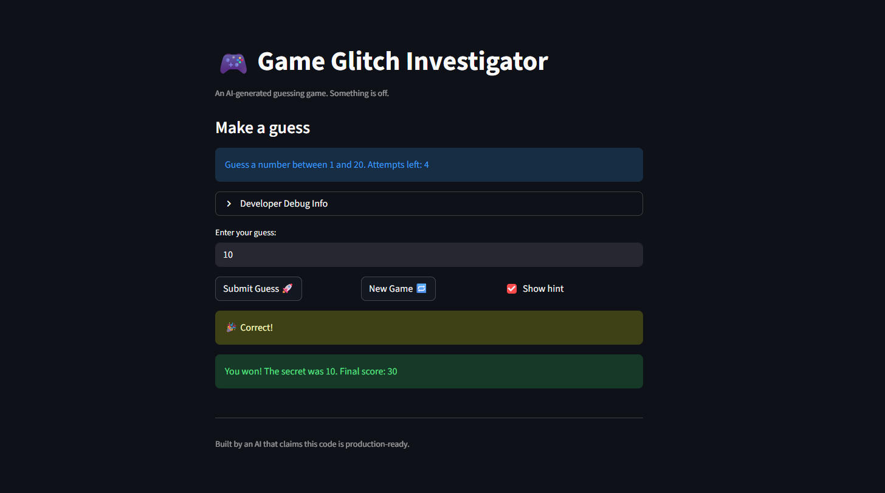

# 🎮 Game Glitch Investigator: The Impossible Guesser

## 🚨 The Situation

You asked an AI to build a simple "Number Guessing Game" using Streamlit.
It wrote the code, ran away, and now the game is unplayable. 

- You can't win.
- The hints lie to you.
- The secret number seems to have commitment issues.

## 🛠️ Setup

1. Install dependencies: `pip install -r requirements.txt`
2. Run the broken app: `python -m streamlit run app.py`

## 🕵️‍♂️ Your Mission

1. **Play the game.** Open the "Developer Debug Info" tab in the app to see the secret number. Try to win.
2. **Find the State Bug.** Why does the secret number change every time you click "Submit"? Ask ChatGPT: *"How do I keep a variable from resetting in Streamlit when I click a button?"*
3. **Fix the Logic.** The hints ("Higher/Lower") are wrong. Fix them.
4. **Refactor & Test.** - Move the logic into `logic_utils.py`.
   - Run `pytest` in your terminal.
   - Keep fixing until all tests pass!

## 📝 Document Your Experience

- [] Describe the game's purpose.  
  The game is a number guessing challenge where players select a difficulty level (Easy, Normal, Hard) and try to guess a secret number within the specified range using limited attempts, receiving hints to guide them higher or lower.
- [] Detail which bugs you found.  
  The hints were reversed (telling you to go higher when you were too high), the secret number changed on every submit due to Streamlit reruns, the New Game button didn't reset state properly, and the attempt counter didn't decrement correctly on the first guess.
- [] Explain what fixes you applied.  
  Corrected the hint messages in "check_guess", moved game logic to "logic_utils.py" for better organization, implemented proper session state management to stabilize the secret number, fixed the New Game reset to clear all state, and adjusted the attempt counter to decrement immediately on submission.

## 📸 Demo

## 🚀 Stretch Features

- [ ] [If you choose to complete Challenge 4, insert a screenshot of your Enhanced Game UI here]
